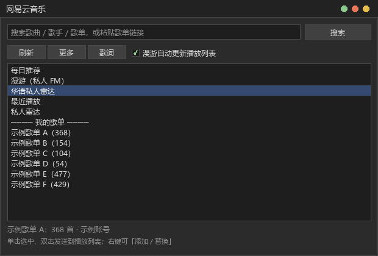
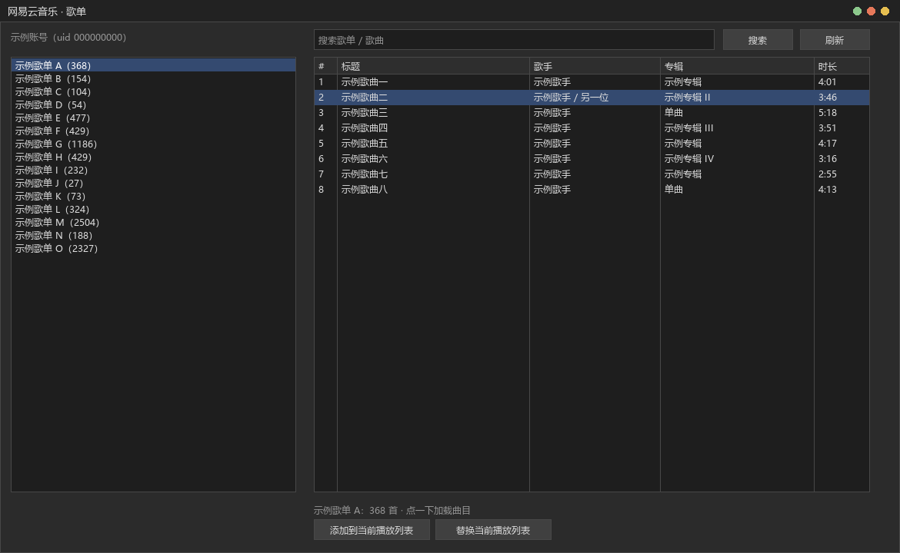
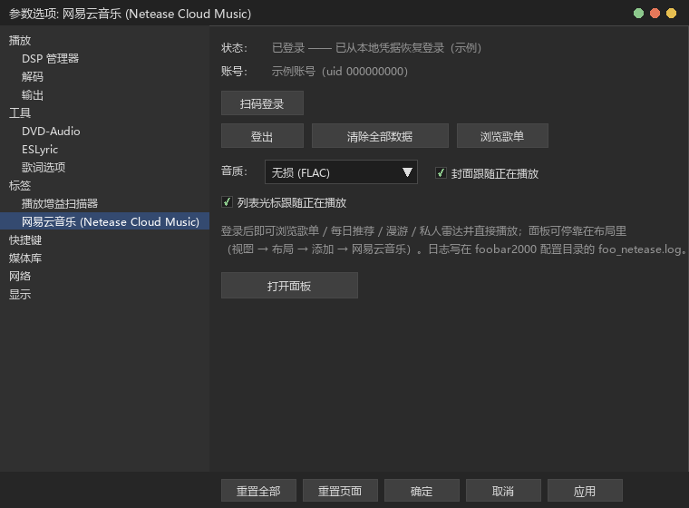

# 本插件由DeepSeek100%构建

# foo_netease

foobar2000 的网易云音乐组件：登录账号、浏览歌单、直接播放。

  

- 版本 **0.22.0** ｜ Windows ｜ foobar2000 **v2.x**（x64 / Win32）
- 第三方个人作品，与网易云音乐官方无关

## 功能

- **登录**：扫码登录；凭据用 DPAPI 加密后存本地
- **可停靠面板**（跟随 foobar2000 的明暗与配色：背景 / 文字 / 选中 / 高亮）：每日推荐 / 漫游（私人 FM）/ 华语私人雷达 / 最近播放 / 私人雷达 / 我的歌单 / 搜索 / 搜索歌单 / 歌单链接；单击选中、双击发送，右键可添加 / 替换 / 添加到新的播放列表 /「下一首播放」/「显示歌单（新窗口）」；文字被截断时悬停显示完整内容
- **歌单浏览窗口**：浏览歌单与曲目，添加或替换到当前播放列表；面板右键可在新窗口里只显示某一个歌单
- **点中列表自动刷新**：用面板右键「添加到新的播放列表」写出的歌单（每日推荐 / 最近播放这类来源也一样），在 foobar2000 的播放列表管理器里点中它时会自动重拉一次并更新内容（同一个列表 15 秒内只刷一次，内容没变就不动、不打扰选中项；追加式写入不记对应关系，所以不会冲掉你自己往列表里加的曲子；整片更新留了撤销点）
- **播放**：组件自己拉流，不依赖官方客户端，支持云盘 Hi-Res；状态栏显示真实码率 / 采样率 / 位深 / 编码
- **播放列表右键「下一首播放」**：加进 foobar2000 播放队列（随机播放下也生效）
- **播放列表右键「切换音质」**：按歌曲当前账号能播的档位列出选项，不支持的档位不会出现；原地改档，列表位置与序号不变，正在播放的那首改完自动重开并接着播、进度不丢；云盘上传的曲子（档位对它们无效）不显示这一项
- **漫游电台**：无限续播，只移除确实播过的曲目（手动往后跳不再误删没听过的），歌快放完时立刻补下一批
- **专辑封面**：列表里每行各取各的那首歌的封面（按条目在线查图，互不影响）；设置里「无封面的条目跟随正在播放」打开时，本地文件等没有封面来源的条目会显示正在播放那首的封面；**歌词**在播放时写成 <profile>\lyrics 下的 .lrc（文件名「标题 - 歌手」和「歌手 - 标题」各写一份，ESLyric 的本地歌词模板不管哪个方向都能命中；这个目录就是 ESLyric 默认的本地歌词目录，不用做任何配置）；同时照旧以**运行时标签**提供歌词（只存在于内存、绝不写进文件），按标签读歌词的显示端（如 WebView2 前端）也能直接用；有逐字版权时写增强型（逐字）歌词；超过一周没再写过的会自动清理，设置里「清除全部数据」也能立刻全清掉；组件自己的 %netease_lyric% / %netease_lyric_enhanced% / %netease_yrc% 字段与歌词窗口照旧（窗口逐字高亮）
- 元数据缓存、%netease_no% 保留歌单内序号、本机播放记录
- **界面缩放可调**：默认跟随系统 DPI，4K 屏觉得挤可在设置里再放大（100%/125%/150%/175%/200%），改完立即生效

## 截图

## 安装

参数设置 → 组件 → 安装… → 选择 `.fb2k-component` → 重启 foobar2000。

## 已知限制

- **不会同步到网易云账号**：foobar2000 里播的歌只进组件自己的「最近播放」

## 说明

- 仅供学习与个人使用，请遵守网易云音乐的服务条款
- 接口来自社区公开的逆向资料，可能随服务端调整而失效
- 不提供、不分发任何音乐内容
